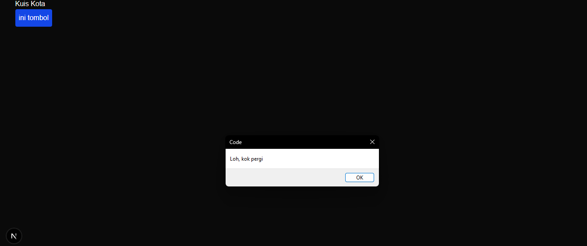
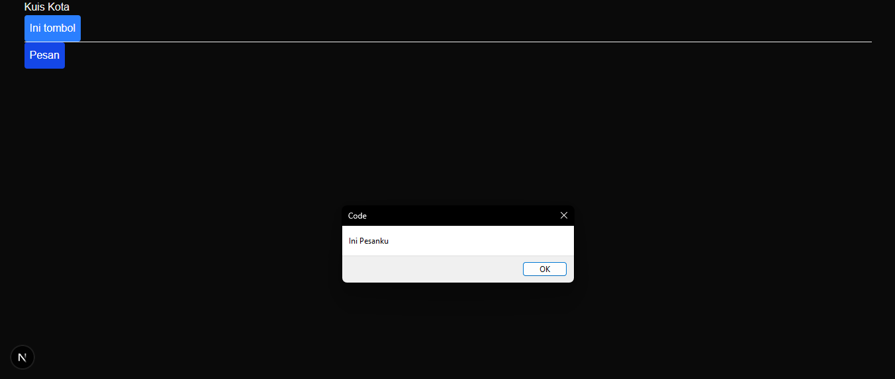
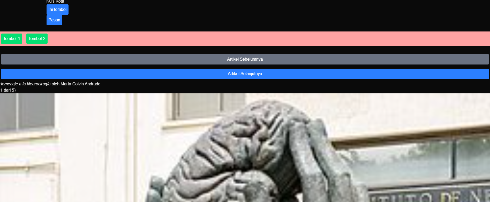
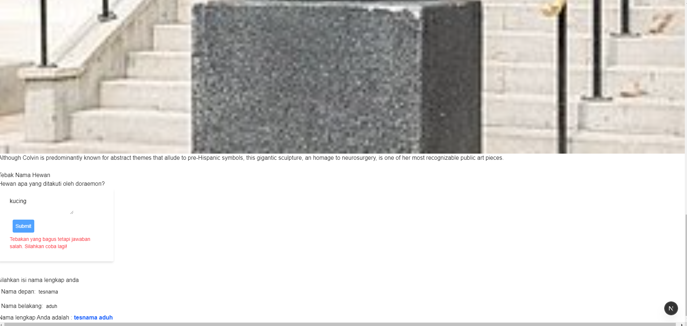
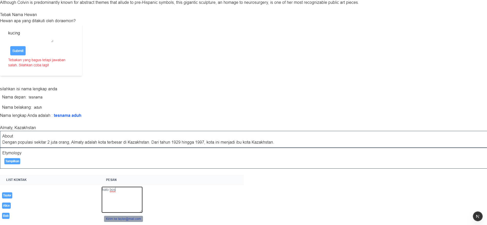

## Praktikum 1

### Bukti Praktikum

### Keterangan
Setelah mengikuti modul Praktikum 1 mengenai Event Handle, pembelajaran yang didapat adalah :

1. **Pembuatan Button dan Event Handler**
2. **Dibutuhkannya `"use client";` saat membuat event handler**
3. **Handle Click tidak boleh dipanggil tapi dioper**

---

## Praktikum 2

### Bukti Praktikum

### Keterangan
Pada Praktikum 2, kita membaca props pada event handler :

1. **Apa yang terjadi di website?**:
   - Muncul teks judul "Kuis Kota"
   - Tombol pertama "ini tombol" jika ditekan memunculkan "Tombol telah ditekan"
   - Tombol kedua yang bertuliskan "Pesan". Ketika tombol ini diklik, muncul alert bertuliskan "Ini Pesanku" 

2. **Mengapa Bisa Begitu?**:
   - Menggunakan Props, Tombol_2 menerima data dari page.tsx dengan props. 
   - Tombol_1 diimpor tanpa {} karna diexport default sedangkan Tombol 2 menggunakan {} karna diexport jadi named export

---

## Praktikum 3

### Bukti Praktikum

### Keterangan
Pada Praktikum 3, kita mempelajari konsep Event Propagation dan Stop Propagation :

1. **Apa yang Terjadi di Website?**:
   - Pada langkah 1 ketika Tombol_1 diklik, akan muncul pesan "Child Element : Tombol-1" lalu diikuti oleh alert lainnya yaitu "Parent Element : Div"
   - Setelah kita stop pakai stopPropagation, yang muncul saat di klik hanya child element saja dan parent element tidak muncul 

2. **Mengapa Bisa Terjadi?**:
   - Di langkah 1 terdapat onClick pada elemnt child tapi juga ada di milik parents jadi keduanya tereksekusi secara berurutan
   - Nah di langkah 2 muncullah metode stopPropagation yangMetode berfungsi menghentikan penyebaran event ke elemen di atasnya (parent), jadi fungsi "onClick" yang ada di `"
"` tidak tereksekusi juga

---

## Praktikum 4

### Bukti Praktikum

### Keterangan 
Pada langkah 1, tombol selanjutnya tidak bisa digunakan,pada langkah 2, kita menambahkan variabel state,dengan begitu tombol selanjutnya bisa kita gunakan dan gambar serta keterangan bisa berubah.

### Jawaban Soal

1. **Apa yang terjadi jika tombol "Artikel Selanjutnya" ditekan 5x (melebihi total artikel)?**
   - Aplikasi akan mengalami error "TypeError: Cannot read properties of undefined"
   - Apa penyebabnya? Array "sculptureList" berisi 5 data, jadi ketika tombol ditekan 5 kali, index menjadi [5], dan saat data "sculptureList[5]" diakses akan menghasilkan "undefined", sehingga pembacaan gagal

2. **Solusi Penanganan Masalah gallery.tsx**:
   - Menambahkan mekanisme batas menggunakan "%".
   - Dengan "(index + 1) % sculptureList.length", ini akan memastikan saat sudah index [4], nilai index akan secara otomatis balik ke [0]

3. **Menambahkan Tombol "Artikel Sebelumnya"**:
   - Menambahkan fungsi "handlePrevClick()" yang membuat index balik ke angka sebelumnya
   - Dengan rumus "(index - 1 + sculptureList.length) % sculptureList.length", agar saat berada di artikel pertama "index [0]" dan kalau tombol "Sebelumnya" diklik, halaman akan melompat ke artikel terakhir

---

## Praktikum 5

### Bukti Praktikum

### Keterangan 
1. **Apa yang Terjadi di Website di langkah 1?**:
   - Terdapat form tebakan, yang jika text kosong maka tombol submit tidak bisa diklik
   - Jika jawaban yang diisi salah, saat submit akan sedikit menunggu lalu akan muncul pesan kesalahan berwarna merah
   - Jika diisi jawaban yang benar, area untuk mengetik text dan submit akan hilang dan berubah menjadi tulisan "Yay... Jawaban Benar!"

2. **Apa yang Terjadi di Website di langkah 2?**
    - Ada penambahan 2 tempat input yaitu nama depan dan nama belakang
    - Saat diketik di salah satu tempat bagian "Nama lengkap Anda adalah" akan langsung memperbarui tampilan secara real-time

### Jawaban Soal Praktikum 5
1. **Apa perbedaan dari fungsi Form_2 yang pertama dengan yang kedua?**:
    - Perbedaan ada di menghapus state yang redundan, di versi pertama, tidak perlu menyimpan fullName ke dalam state karena nilai di kedua inputannya bisa diturunkan dari gabungan firstName dan lastName
    - Proses render lebih cepat, di versi kedua, komponen langsung re render dan menghitung ulang secara real-time tanpa harus memproses pembaruan state yang redundan

2. **Kenapa perlu menghapus state fullName? apa keuntungannya??**
    State fullName perlu dihapus karena nilainya dapat dihitung langsung dari gabungan firstName dan lastName saat render.
    
    Keuntungan Menghapus State fullName :
    - Mencegah Bug
    - Kode jadi lebih sederhana
    - Lebih cepet dan efisien

---

## Praktikum 6

### Bukti Praktikum

### Keterangan
1. **Hasil di Browser pada Bagian 1**
    Muncul judul "Almaty, Kazakhstan" dan dua bagian yaitu "About" dan "Etymology". Diawal, bagian "About" menampilkan isi teksnya, sedangkan Etymology hanya ada tombol "Tampilkan". Saat tombol "Tampilkan" diklik, tombol "Tampilkan" akan muncul di bagian "About" dan bagian "Etymology" akan memunculkan teksnya, Jadi saling bergantian menunjukkan teks saat dipencet tampilkan.

2. **Perbandingan sebelum dan sesudah di edit pada bagian 2**
    Saat masih menggunakan `"<Chat contact={to} />"` mengetik chat pada salah satu alamat email dan kita pencet tombol alamat email lainnya, akan mengubah tujuan pengiriman email tetapi text box tidak tereset. Saat kita ubah menjadi `"<Chat key={to.email} contact={to} />"` mengklik tombol alamat email orang yang lain akan mereset isian yang tertulis didalam text boxnya.

### Jawaban Soal Praktikum 6
1. **Apa tujuan dari penulisan key={to.email} pada `"<Chat key={to.email} contact={to} />"`?**
    Tujuannya adalah memberitahu React bahwa jika penerima berbeda, dan itu harus dianggap sebagai komponen chat yang berbeda yang perlu dibuat kembali dari awal dengan data yang baru. tanpa key, React menganggap posisi komponen Chat di layar tidak berubah. Jadinya, pesan yang kita ketik tidak akan terhapus dan malah kebawa ke alamat email yang lainnya.

2. **Apa fungsi dari props key tersebut?**
    Fungsi utama dari props key dalam React adalah sebagai identitas yang unik bagi komponen. Dengan props key, kita bisa mereset state komponen, mencegah state tertukar, dan render jadi lebih optimal.

